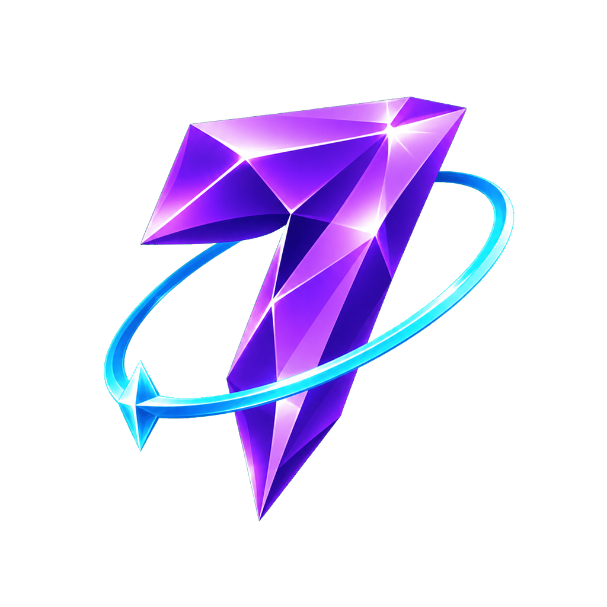
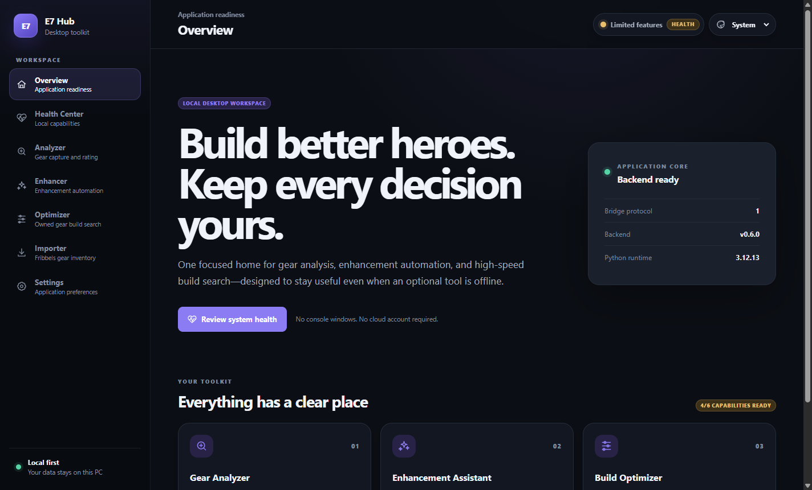
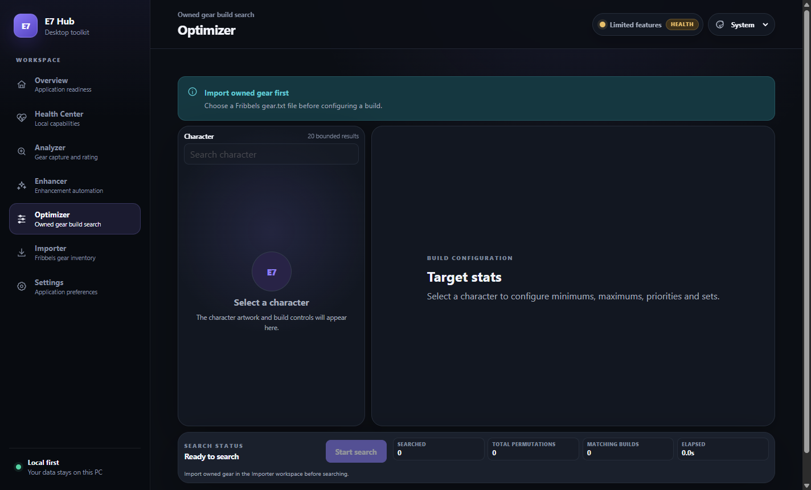
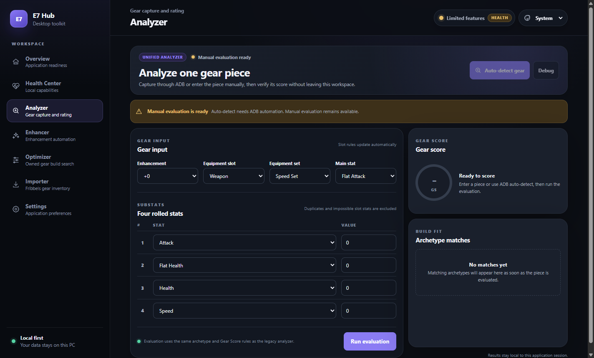
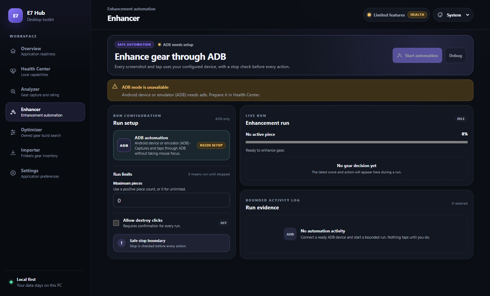

<p align="center">
  
</p>

# Meowtoko E7 Tool

Meowtoko E7 Tool is a free, unofficial Windows desktop companion for Epic Seven. It
combines owned-gear optimization, gear analysis, live game-data import,
packet-accurate ADB enhancement automation, and local capability checks in one
compact application.

The application, inventory database, optimizer, and automation run on the
user's PC. Live packet workflows use Meowtoko E7 Tool's stateless normalization service.
Normal users launch the installed Meowtoko E7 Tool shortcut and need no PowerShell
window, system Python installation, Node.js setup, or cloud account.

**[Download the latest release](https://github.com/Motokochi/Meowtoko-E7-Tool/releases/latest)**

> Meowtoko E7 Tool is currently an unsigned fan-made application. Windows may show an
> unknown-publisher warning. Install it only when you obtained it from this
> repository and your own Windows or organization policy permits unsigned
> applications.



## What it includes

| Workspace | Purpose |
|---|---|
| **Importer** | Captures owned gear and 5★+ heroes from game traffic, or imports a Fribbels `gear.txt`. |
| **Gear** | Browses imported `+15` equipment with compact filters, equipped-owner portraits, and reforged Gear Score metrics. |
| **Optimizer** | Searches six-piece builds on CPU or optional NVIDIA CUDA, then filters, sorts, exports, and displays exact gear cards. |
| **Analyzer** | Scores one gear piece from compact manual input or an ADB screenshot. |
| **Enhancer** | Uses exact enhancement packets with bounded ADB taps, a safe stop, and explicit destructive confirmation. |
| **Health Center** | Checks the packaged backend and isolated packet capture, ADB, OCR, Ollama, and GPU capabilities. |
| **Settings** | Configures appearance, ADB, screenshot regions, click points, and timing without editing files. |

Meowtoko E7 Tool is useful even when an optional tool is unavailable. CPU optimization
and manual Analyzer entry do not depend on ADB, Ollama, Tesseract, or CUDA.

## Requirements

- Windows 10 or Windows 11 on x64 hardware.
- Npcap for live game-data import and packet-accurate enhancement reads, or a
  Fribbels `gear.txt` when only inventory import is needed.
- Android Platform Tools/ADB for screenshots, previews, and enhancement taps.
- A compatible NVIDIA GPU and driver only for optional CUDA acceleration.

The installer contains the Electron interface, packaged Python backend,
offline game-data snapshot, character artwork, and required application
runtime. Optional CUDA components are a separate, user-approved download that
can exceed 1 GB and occupy several GB.

## Install and first launch

1. Open the [latest GitHub Release](https://github.com/Motokochi/Meowtoko-E7-Tool/releases/latest).
2. Download the versioned file whose name ends in `Setup.exe`. Do not use the
   automatically generated **Source code** archives; they are not installers.
3. Double-click the installer.
4. If Windows shows **Windows protected your PC**, choose **More info**, verify
   that the application is **Meowtoko E7 Tool**, and choose **Run anyway** only if your
   policy allows it. Meowtoko E7 Tool does not bypass Smart App Control or organization
   policy.
5. Open **Meowtoko E7 Tool** from its desktop or Start menu shortcut.
6. Open **Health Center**. The packaged backend should report ready; optional
   capabilities are shown independently with their setup or repair actions.

Administrator access is not normally required. Reinstalling or updating the
application preserves app-owned data under the existing compatibility path
`%APPDATA%\E7 Hub`, so upgrades from E7 Hub keep all local data.

For the full unsigned-installer, optional-component, uninstall, and reinstall
details, see [Installing Meowtoko E7 Tool](docs/INSTALLING.md).

## Import and optimize owned gear

### 1. Import gear and heroes

For live import:

1. Install Npcap from the setup action in **Health Center**, then restart E7
   Hub.
2. Open **Importer** and choose **Start capturing from game**.
3. Fully exit Epic Seven (do not only minimize it), reopen it, continue to the
   main screen, and wait until it fully loads.
4. Choose **Done Capturing**. Meowtoko E7 Tool sends bounded game-response candidates to
   its stateless AWS service, which identifies and normalizes the account
   snapshot. The resulting `Documents\MeowtokoE7Hub\gear.txt` is then imported
   into the local database.

Live import keeps every recognized gear piece, including gear below `+15`, so
the Enhancer can resolve its set by item ID. It imports heroes whose current
grade is 5★ or 6★. The Optimizer still searches only `+15` gear.

As an alternative, choose **Select gear.txt** and select the file exported by
Fribbels. A common location is:

```text
Documents\FribbelsOptimizerSaves\gear.txt
```

Meowtoko E7 Tool reads a file only after you select it. Live capture is limited to the
two game response ports used by the importer and enhancer; unrelated traffic
is ignored and captured traffic is never written to disk. Only bounded opaque
response candidates are sent to the stateless service. The normalized
inventory stays local. Reports do not expose or retain a source path or raw
file. Re-import merges stable gear identities and preserves Meowtoko E7 Tool-owned
metadata.

**Erase all optimizer data** is intentionally separate and requires an
explicit confirmation. It removes imported gear, saved hero profiles, and
optimizer results.

### 2. Browse +15 equipment

Open **Gear** to compare every imported `+15` piece in a compact table. Search
by set, stat, or equipped hero; filter by slot, set, rarity, main/substats,
level, lock state, and score; then select a row to inspect the same equipment
card used by Optimizer results. `RGS`, `CGS`, and `SGS` are Fribbels Gear
Score, Combat Score, and Support Score calculated from the piece's reforged
projection. The card continues to show the real current item stats.

The Gear workspace is read-only. Update ownership, stats, or newly enhanced
items by importing a fresh inventory.

### 3. Configure the hero and build

Open **Optimizer** and:

1. Select a character. The app then displays its bundled pose and exact base
   profile choices.
2. Use **Add bonus stats** for artifacts, imprints, exclusive equipment,
   custom modifiers, and independent S1/S2/S3 damage contexts.
3. Enter any inclusive minimum and maximum primary-stat bounds. Blank means
   unrestricted; `0` remains a real boundary.
4. Set each primary-stat priority from `-1` through `3`. The displayed `Prio`
   follows Fribbels-style independently rounded item scoring.
5. Choose up to three set requirements. **None (any set)** leaves that capacity
   unrestricted, so sets may be completely optional, `4+2`, or `2+2+2`.
6. Choose whether gear equipped by other heroes is eligible with **Include
   equipped**.
7. Optionally enable **Use reforged stats**. The optimizer otherwise uses
   imported current values and always considers only `+15` gear.
8. Open **Secondary stat filters** only when you need right-side main-stat or
   derived-metric restrictions.



### 4. Search and inspect results

Choose **Start search**. Automatic execution uses the app-owned CUDA component
only after its readiness probe succeeds; otherwise it uses the deterministic
CPU path. A failed CUDA run can be restarted from permutation zero on CPU.

The exact-result ceiling is 5,000,000 builds. If build 5,000,001 matches, E7
Hub stops without presenting a partial run and asks for stricter requirements.
Narrow with primary or derived metrics, requested sets, right-side main stats,
or equipped-gear eligibility.

The result table keeps every primary and derived metric compact and sortable.
`CR` deliberately remains uncapped above 100 so wasted Critical Hit Chance is
visible, while damage formulas use the effective gameplay cap. Select any row
to open six owned-gear cards. Completed set icons, current equipped-owner
portraits, main/substats, Gear Score, and lock/equipped state remain visible.

**Equip** updates ownership only inside Meowtoko E7 Tool and leaves the build cards open
as an in-game checklist. It never taps or changes Epic Seven. Selecting another
hero or starting a new search clears the previous results. CSV/JSON export
writes the complete active filtered and sorted view through the Windows Save
dialog.

The complete field-by-field workflow is in the
[user guide](docs/USER_GUIDE.md), and every derived formula is in the
[metric reference](docs/METRICS.md).

## Analyze gear

Analyzer keeps one piece's identity and four substats beside Gear Score and
archetype results. Enter the piece manually, or use **Auto-detect gear** after
ADB is ready. Calculation details and bounded OCR/debug evidence are available
without turning the page into a wall of text.



Manual evaluation remains available when ADB, OCR, or Ollama is not ready.

## Enhance with packets and ADB

Enhancer captures bounded game responses locally and sends them to Meowtoko E7 Tool's
stateless packet service for private identification and normalization. Every
tap still runs through the configured ADB device, and enhancement decisions do
not use OCR or AI.

Import a fresh `gear.txt` before every run. Enhancer uses the packet item ID to
load the piece's previous enhancement level, rarity, and set. Missing or stale
inventory metadata stops automation instead of guessing or falling back to
OCR.

For each newly opened piece, Enhancer first spends one basic powder to obtain
its exact item ID and current packet history. It then targets the next `+3`
checkpoint; if the identification powder crossed that checkpoint, the packet
is used directly instead of repeating the upgrade. The newest operation in
each `+3`, `+6`, `+9`, `+12`, and `+15` packet counts as one enhancement event,
and original substats never count as events. Existing event history is
reconstructed using the imported rarity and enhancement level, including
non-Epic gear that began with fewer than four substats.

The quality path begins at 62 potential GS and continues while potential GS is
at least 58. Independently, a piece is kept when four of its five enhancement
rolls land on the same stat. If neither outcome remains possible, the piece is
rejected. A missing packet is retried at the same target after a two-second
wait instead of guessing from the screen.

Enhancer places run limits and destructive permission beside live progress,
the latest decision, and a bounded evidence log. The stop boundary is checked
before every action. **Allow destroy clicks** is off on first use; after you
change it, the choice persists until you manually change it again. Enabling it
still requires confirmation when a run starts.



Use **Browse for adb.exe** in **Settings** and configure the optional device
serial, then confirm **ADB automation** and **Game packet capture** in **Health Center**.
Never continue an automation run when the configured preview or coordinates
are wrong.

## Optional tools and connectivity

| Capability | What it enables | If unavailable |
|---|---|---|
| **Npcap** | Live inventory import and exact Enhancer stat reads | Fribbels `gear.txt`, Analyzer, and optimization remain available. |
| **ADB** | Analyzer capture, Settings previews, and Enhancer taps | Manual Analyzer and optimization remain available. |
| **Internet** | Stateless normalization for live packet import and Enhancer | Fribbels `gear.txt`, Analyzer, and optimization remain available. |
| **Tesseract** | Local OCR during automatic analysis | Manual gear entry remains available. |
| **Ollama** | Optional local interpretation support | Unrelated workflows remain available. |
| **CUDA component** | High-throughput NVIDIA optimizer search | Deterministic CPU optimization remains available. |

Health Center installs or opens only the narrowly relevant setup path. Meowtoko E7 Tool
does not silently install a display driver, system CUDA Toolkit, or `nvcc`.

## Consent-first updates

Installed releases perform a small public GitHub metadata check after startup
and at a bounded interval. A check does not invoke Squirrel or download the
large package.

When a newer stable release exists:

1. Meowtoko E7 Tool shows its version, concise notes, and expected package size.
2. Nothing downloads until you choose **Download and restart**.
3. When the download finishes, Meowtoko E7 Tool stops local work, installs the update,
   and reopens automatically.
4. Save first: accepting the download also accepts stopping any active search,
   export, Analyzer scan, enhancement job, health operation, or unsaved edit.

**Later** dismisses only that release. Manual checking and release notes remain
available in **Settings**. Offline or GitHub errors never disable the app.

## Local data and privacy

Settings, normalized inventory, hero profiles, results, optional GPU
components, and kernel cache stay under `%APPDATA%\E7 Hub`. Raw packet traffic
is not saved. During live inventory capture and enhancement, bounded opaque
game-response candidates are sent over HTTPS to Meowtoko E7 Tool's stateless AWS API;
the service identifies and normalizes the required response without storing
it. Meowtoko E7 Tool does not require the user to have a cloud account. GitHub is contacted for public update
metadata and an accepted release download; optional tool installers use their
documented sources only after a user action.

Uninstall removes the application and shortcuts but preserves app-owned data
for reinstall. Do not delete the entire data directory as routine
troubleshooting. Follow the [data recovery guide](docs/RECOVERY.md) before
restoring settings, the inventory database, profiles, results, or CUDA data.

## Troubleshooting

| Problem | First action |
|---|---|
| Windows blocks the installer | Confirm it came from the official release. Respect Smart App Control or organization policy; Meowtoko E7 Tool does not bypass it. |
| Backend unavailable | Restart Meowtoko E7 Tool, then inspect **Health Center**. Do not launch retired Python/Tk or PowerShell entry points. |
| ADB unavailable | Configure `adb` and the correct serial in **Settings**, authorize the device, then refresh **Health Center**. |
| Packet capture unavailable | Install Npcap from its official installer, restart Meowtoko E7 Tool, and refresh **Health Center**. |
| Live import has no account packet | Leave capture running, fully reopen Epic Seven to the main screen, then choose **Done Capturing** again. |
| File import rejected | Select Fribbels `gear.txt`, review row-level issues, and avoid unrelated export formats. |
| More than 5,000,000 matches | Tighten stats, metrics, sets, eligible mains, or equipped-gear scope and run again. |
| CUDA limited or failed | Keep using CPU, update/check the NVIDIA driver outside Meowtoko E7 Tool, then use **Repair GPU components**. |
| Update check failed | Continue using the app and retry from **Settings** later; the installed version is unchanged. |
| Reinstall appears empty or damaged | Stop Meowtoko E7 Tool and follow the validated [recovery procedure](docs/RECOVERY.md). |

## Development

The public source uses Electron Forge + React + TypeScript for the desktop
shell and a packaged Python backend for packet capture, OCR, ADB, persistence,
and optimization.
The renderer is sandboxed, has no Node integration, and communicates through a
strict typed preload bridge.

Start with:

- [Desktop development and packaging](docs/development/DESKTOP.md)
- [CUDA runtime contract](src/optimizer/cuda/CUDA_RUNTIME.md)
- [Result lifecycle](src/optimizer/result_store/RESULT_LIFECYCLE.md)

Core semantic roots are `assets`, `desktop`, `src`, `tests`, `scripts`,
and `docs`. Generated builds, caches, local databases, debug images, private
planning notes, benchmark evidence, and release artifacts are ignored rather
than committed.

Before contributing, run the pinned Python suite, desktop tests/type-check, and
documentation validator described in the development guide. Stable releases
are built only from a matching `vMAJOR.MINOR.PATCH` tag after the complete
Windows audit and smoke pipeline passes.

## Unofficial project and attribution

Meowtoko E7 Tool is not affiliated with, endorsed by, or sponsored by Smilegate, Super
Creative, or the Epic Seven rights holders. Epic Seven names, characters,
statistics, and artwork remain the property of their respective rights
holders.

The offline data snapshot and Fribbels-compatible behavior are pinned and
documented. Character artwork, equipment icons, set icons, application art,
runtime notices, hashes, and exact source revisions are recorded in
[Attribution, data provenance, and project status](docs/legal/ATTRIBUTION.md).

The Meowtoko E7 Tool package currently declares `UNLICENSED`; a public repository does
not by itself grant reuse or redistribution rights. Third-party components
retain their own licenses and notices.
